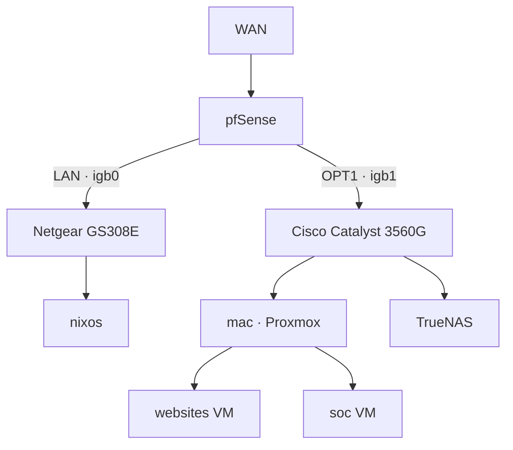

## Purpose

Document the physical and virtualization topology of ThornCloud. Addresses and endpoints remain canonical in [[05 Network/Host & IP Inventory|Host & IP Inventory]].

## Current Known State

- `WAN` terminates on the physical pfSense router.
- pfSense `igb0` feeds the flat LAN through the Netgear GS308E.
- pfSense `igb1` feeds the flat OPT1 services network through the Cisco Catalyst 3560G.
- `nixos` is a confirmed LAN host.
- Mac/Proxmox and TrueNAS are confirmed OPT1 hosts.
- `websites` and `soc` are virtual machines hosted by Mac/Proxmox and addressed on OPT1.

## Layer 2 Boundaries

- There are no VLANs, tagged trunks, or access-port VLAN assignments.
- LAN and OPT1 are separate physical Ethernet segments joined only by routing through pfSense.
- Hosts on the same segment communicate through their switch without traversing pfSense.
- Traffic between `websites` and `soc` may remain inside the Proxmox Linux bridge.

## Proxmox Networking

- Mac's `enp9s0` interface is the OPT1 uplink and is attached to `vmbr0`.
- The Proxmox management address is assigned to `vmbr0`.
- `enp10s0` is currently unused.
- `vmbr1` and `vmbr2` currently have no physical interfaces attached.
- Linux bridge names do not imply VLAN use.

## Visibility Implications

- Zeek on Mac can inspect traffic visible to the Proxmox bridge, including traffic involving its guests.
- Mac does not automatically see unrelated LAN traffic because LAN is a different physical segment.
- Full-switch visibility would require a mirror/SPAN port or a network TAP; that is not part of the current topology.

## Unknown Details

- Exact physical port numbers on the Netgear and Cisco switches.
- Whether any additional, undocumented devices are connected to either switch.
- Switch management addresses and management-access policy.

## Related

- [[01 Maps/Network Map|Network Map]]
- [[05 Network/Host & IP Inventory|Host & IP Inventory]]
- [[05 Network/Routing|Routing]]
- [[05 Network/VLANs|VLANs]]
- [[03 Devices/pfSense Router|pfSense Router]]
- [[03 Devices/Mac Pro 5,1|Mac Pro 5,1]]

